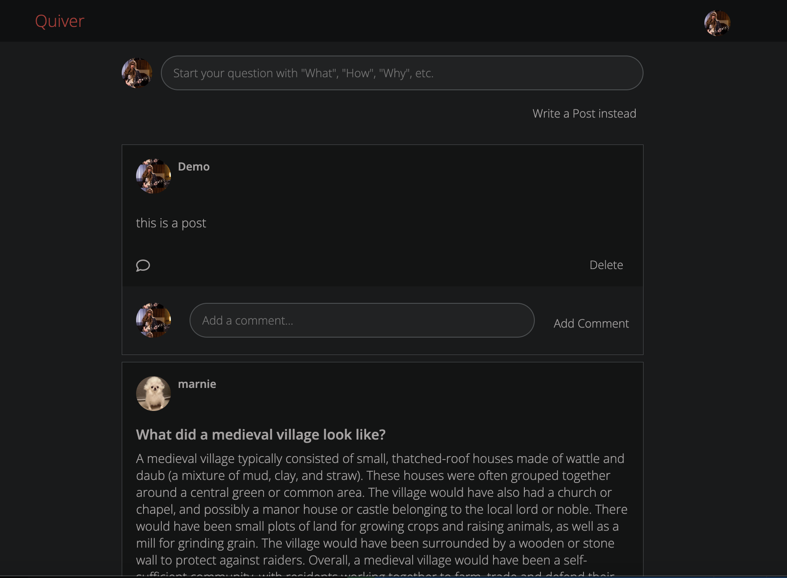
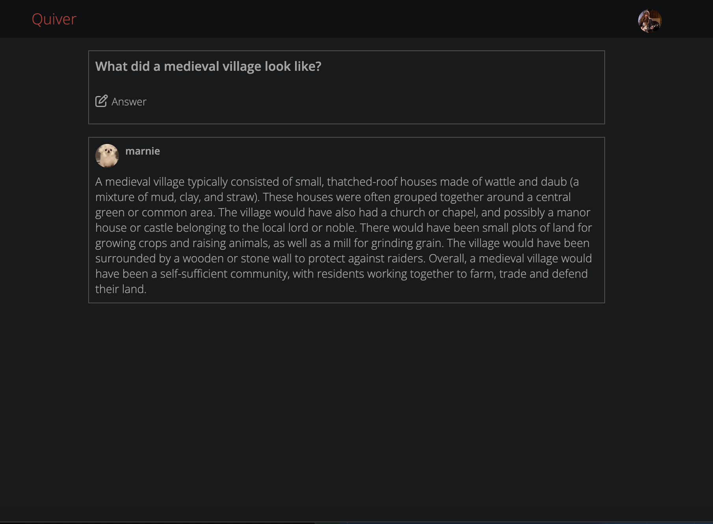

# Quiver

A simplified quora clone with global dark mode. Featuring questions/answers and posts/comments. In the future I want to add 
- profile picture upload (AWS)
- adding pictures to questions and posts (AWS)
- user section
- "spaces"
- pagination

[live site](https://quiver.onrender.com)


## Technologies Used
- Flask
- React
- Redux
- SQLAlchemy
- Javascript

## Features
CRUD for Questions and Answers
CRD for Posts and Comments




Contact me :
[Linkedin](https://www.linkedin.com/in/hannazitarosenfeld/)

## Endpoints
GET /api/auth
- Purpose: This fetch is sent upon initial app load and on subsequent freshes. It returns an object representing the current user, if user is logged in.
- Return:
```
{
    'id': INT,
    'username': STRING,
    'email': STRING    
}
```

POST /api/login/
- Purpose: This fetch attempts to login a user with the provided credentials.
It returns an object representing the current user, if validation succeeds.
- Return Value:
```
{
    'id': INT,
    'username': STRING,
    'email': STRING
}
```
